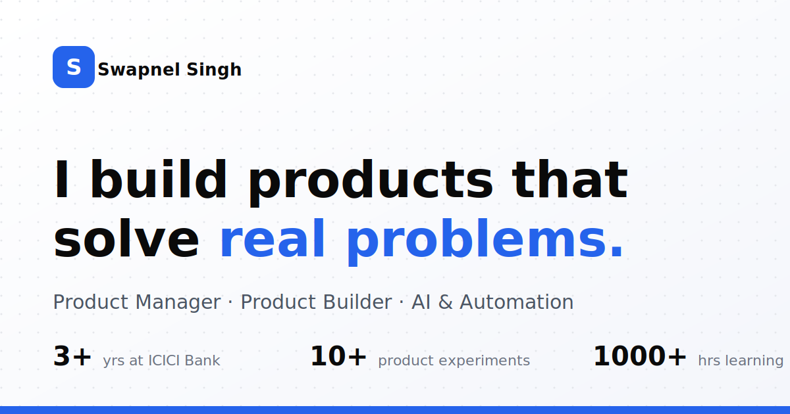

# Swapnel Singh — Portfolio

A premium, recruiter-friendly personal portfolio for a Product Manager who **builds and ships**, not just specs. Inspired by Linear, Vercel, Stripe, and Notion — minimal, fast, and fully responsive with light/dark mode.



## ✨ Features

- **Hero** with animated stat counters and clear CTAs (View Projects, Download Resume, LinkedIn)
- **About** + product philosophy
- **Experience** timeline (ICICI Bank)
- **Featured Projects** — each an alternating case-study card with generated UI mockups
- **Product Thinking** skill cloud
- **Case Studies** — full expandable detail pages (problem → user → journey → insights → solution → wireframes → metrics → tradeoffs → impact → future)
- **Writing**, **Journey timeline**, **Contact**, and footer
- **Dynamic detail pages** for every project (`/projects/[slug]`) and case study (`/case-studies/[slug]`)
- Floating glassmorphism nav, smooth scroll, Framer Motion reveal animations
- Light + dark themes (`next-themes`, class strategy)
- SEO: metadata, OpenGraph/Twitter tags, generated `sitemap.xml` + `robots.txt`
- Fully responsive, mobile-first

## 🧱 Tech Stack

| Area | Choice |
| --- | --- |
| Framework | [Next.js 16](https://nextjs.org) (App Router, Turbopack) |
| Language | TypeScript |
| Styling | Tailwind CSS v4 |
| Animation | Framer Motion |
| Icons | Lucide (+ custom brand SVGs for LinkedIn/GitHub) |
| Theming | next-themes |
| UI primitives | Hand-built, shadcn-style components (`components/ui`) |

> Note: components follow the shadcn/ui design language but are written in-repo (no generator) so everything is fully owned and editable in `components/ui`.

## 🚀 Getting Started

```bash
# 1. Install dependencies
npm install

# 2. Run the dev server
npm run dev
# → http://localhost:3000

# 3. Production build
npm run build && npm start
```

Requires Node.js 18.18+ (developed on Node 26).

## 🗂 Project Structure

```
app/
  layout.tsx            # Root layout, fonts, SEO metadata, theme provider, nav
  page.tsx              # Homepage (composes all sections)
  globals.css           # Tailwind v4 + design tokens + dark mode
  projects/[slug]/      # Dynamic project detail pages
  case-studies/[slug]/  # Dynamic case study detail pages
  sitemap.ts, robots.ts # SEO
  not-found.tsx         # Custom 404
components/
  nav.tsx               # Floating navigation bar
  theme-provider.tsx
  theme-toggle.tsx
  sections/             # Hero, About, Experience, Projects, etc.
  ui/                   # Button, Badge, Reveal, Accordion, AnimatedCounter,
                        # SectionHeading, ProjectMock, brand icons
lib/
  data.ts               # ★ Single source of truth for ALL content
  utils.ts              # cn() helper
public/
  resume.pdf            # Replace with your real CV
  og.svg, favicon.svg
```

## ✏️ Editing Content

**Almost everything lives in [`lib/data.ts`](lib/data.ts).** Edit copy there and it propagates to every section and detail page — projects, case studies, experience, articles, timeline, links, and stats.

A few things to personalize:

- **Resume:** replace `public/resume.pdf` with your real CV (same filename).
- **Profile photo:** the hero shows a placeholder icon. Drop a `public/profile.jpg` and swap the `<User />` placeholder in `components/sections/hero.tsx` for `next/image`.
- **Links:** update `site.links` (LinkedIn, GitHub, email) and `site.url` in `lib/data.ts`.
- **Project mockups:** the "screenshots" are generated UI in `components/ui/project-mock.tsx`. Replace with real screenshots if you prefer.

## ☁️ Deploying to Vercel

1. Push this repo to GitHub.
2. Go to [vercel.com/new](https://vercel.com/new) and import the repository.
3. Vercel auto-detects Next.js — no configuration needed. Click **Deploy**.
4. After the first deploy, set your production URL in `lib/data.ts` (`site.url`) so OpenGraph/sitemap use the right domain, then redeploy.

Or via the CLI:

```bash
npm i -g vercel
vercel          # preview deploy
vercel --prod   # production deploy
```

## 📄 License

Personal project — content © Swapnel Singh. Code is free to reuse as a template.
